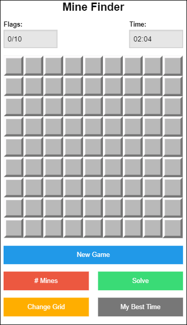

    This program is a minesweeper game clone with a solver added to it.
    The game can be played without the solver.

    To run the game, open the file in your browser and start playing.
    Tested only on Chrome and Mozilla. 

    Solve button: will attempt to solve the game. 
        It will either solve, lose, or get stuck

    #Mines button: will let you change the number of mines. (1 <= n <= 100 ).
        It will start a new game after change.

    New game button: will end current game, randomize the board for a new game. 

    I tested 40 games with 30 mines and 40 games with 40 mines. 
    These are the results for Wins, Losses, Stuck. 

	Date: 12/1/14
    30 mines (40 games)     40 mines (40 games)
        W – 60 %               W – 12.5 %
        L - 15 %               L - 40   %
        S - 25 %               S - 47.5 %
		
	Date: 4/28/15
    30 mines (40 games)     40 mines (40 games)
        W – 50 %               W – 27.5 %
        L - 30 %               L - 27.5 %
        S - 20 %               S - 45   %
		

    Added new features:
    	- keeps track of best time according to grid/# of mines
    		- score only applies if solver not used
    	- multiple grid sizes (9x9 and 16x16)
    	- player wins when only mines are left unopened

  

